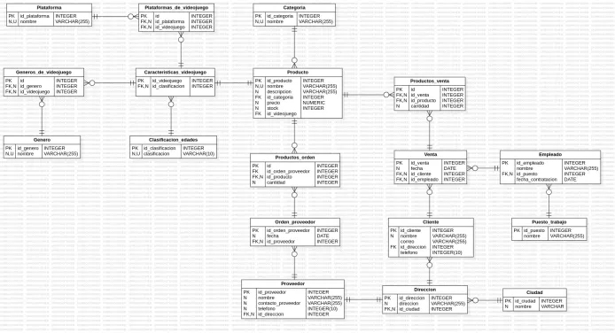

<h1> Taller MySQL II: Tienda de Videojuegos Data Base 🎮</h1>

Este sistema está enfocado en cubrir los aspectos fundamentales de la administración académica, incluyendo estudiantes, cursos, docentes, aulas y horarios. A continuación podrás ver el desarrollo y normalización de esta base de datos:

## Tabla de Contenidos
- [Instalación](#instalación)
- [Diagrama Lógico](#diagrama)
- [Entidad-Relación](#entidad-relación)
- [Consultas](#consultas)
- [Contacto](#contacto)

## Instalación
1. Clona este repositorio, para obtener una copia local del proyecto:
   ```bash
   git clone https://github.com/LauraAmaya08/TiendaVideojuegos_LuisMendezLauraAmaya-
   ```

## Diagrama


## Entidad-Relación

## Relaciones


## Contacto
Para cualquier pregunta o sugerencia, por favor contacta a:
- **Nombre:** Laura Amaya / Nicolas Mendez
- **Email:** laurasofiaamayacasado@gmail.com / nicolas-mendez@hotmail.com

