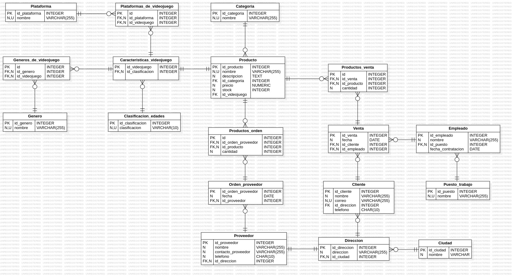

<h1> Taller MySQL II: Tienda de Videojuegos Data Base 🎮</h1>

Este sistema está enfocado en cubrir los aspectos fundamentales de la administración académica, incluyendo estudiantes, cursos, docentes, aulas y horarios. A continuación podrás ver el desarrollo y normalización de esta base de datos:

## Tabla de Contenidos
- [Instalación](#instalación)
- [Diagrama Lógico](#diagrama)
- [Entidad-Relación](#entidad-relación)
- [Consultas](#consultas)
- [Contacto](#contacto)

## Instalación
1. Clona este repositorio, para obtener una copia local del proyecto:
   ```bash
   git clone https://github.com/LauraAmaya08/TiendaVideojuegos_LuisMendezLauraAmaya-
   ```

## Diagrama


## Entidad-Relación

1. **Plataforma**
   - **Atributos**:
     - `id_plataforma`: Identificador único de la plataforma.
     - `nombre`: Nombre de la plataforma.

2. **Categoría**
   - **Atributos**:
     - `id_categoria`: Identificador único de la categoría.
     - `nombre`: Nombre de la categoría.

3. **Género**
   - **Atributos**:
     - `id_genero`: Identificador único del género.
     - `nombre`: Nombre del género.

4. **Clasificación de Edades**
   - **Atributos**:
     - `id_clasificacion`: Identificador único de la clasificación.
     - `clasificacion`: Descripción de la clasificación (ej. "18+").

5. **Características del Videojuego**
   - **Atributos**:
     - `id_videojuego`: Identificador único del videojuego.
     - `id_clasificacion`: Referencia a la clasificación del videojuego.

6. **Plataformas del Videojuego**
   - **Atributos**:
     - `id`: Identificador único de la relación.
     - `id_plataforma`: Referencia a la plataforma.
     - `id_videojuego`: Referencia al videojuego.

7. **Géneros del Videojuego**
   - **Atributos**:
     - `id`: Identificador único de la relación.
     - `id_genero`: Referencia al género.
     - `id_videojuego`: Referencia al videojuego.

8. **Producto**
   - **Atributos**:
     - `id_producto`: Identificador único del producto.
     - `nombre`: Nombre del producto.
     - `descripcion`: Descripción del producto.
     - `id_categoria`: Referencia a la categoría del producto.
     - `precio`: Precio del producto.
     - `stock`: Cantidad disponible.
     - `id_videojuego`: Referencia al videojuego.

9. **Ciudad**
   - **Atributos**:
     - `id_ciudad`: Identificador único de la ciudad.
     - `nombre`: Nombre de la ciudad.

10. **Dirección**
    - **Atributos**:
      - `id_direccion`: Identificador único de la dirección.
      - `direccion`: Dirección específica.
      - `id_ciudad`: Referencia a la ciudad.

11. **Cliente**
    - **Atributos**:
      - `id_cliente`: Identificador único del cliente.
      - `nombre`: Nombre del cliente.
      - `correo`: Correo electrónico del cliente.
      - `id_direccion`: Referencia a la dirección.
      - `telefono`: Número de teléfono.

12. **Puesto de Trabajo**
    - **Atributos**:
      - `id_puesto`: Identificador único del puesto.
      - `nombre`: Nombre del puesto.

13. **Empleado**
    - **Atributos**:
      - `id_empleado`: Identificador único del empleado.
      - `nombre`: Nombre del empleado.
      - `id_puesto`: Referencia al puesto de trabajo.
      - `fecha_contratacion`: Fecha de contratación.

14. **Venta**
    - **Atributos**:
      - `id_venta`: Identificador único de la venta.
      - `fecha`: Fecha de la venta.
      - `id_cliente`: Referencia al cliente.
      - `id_empleado`: Referencia al empleado.

15. **Proveedor**
    - **Atributos**:
      - `id_proveedor`: Identificador único del proveedor.
      - `nombre`: Nombre del proveedor.
      - `contacto_proveedor`: Información de contacto.
      - `telefono`: Número de teléfono.
      - `id_direccion`: Referencia a la dirección.

16. **Orden de Proveedor**
    - **Atributos**:
      - `id_orden_proveedor`: Identificador único de la orden.
      - `fecha`: Fecha de la orden.
      - `id_proveedor`: Referencia al proveedor.

17. **Productos de Orden**
    - **Atributos**:
      - `id`: Identificador único de la relación.
      - `id_orden_proveedor`: Referencia a la orden.
      - `id_producto`: Referencia al producto.
      - `cantidad`: Cantidad del producto en la orden.

18. **Productos de Venta**
    - **Atributos**:
      - `id`: Identificador único de la relación.
      - `id_venta`: Referencia a la venta.
      - `id_producto`: Referencia al producto.
      - `cantidad`: Cantidad del producto vendido.


## Relaciones
1. **Videojuegos y Clasificación de Edades**
   - **Relación**: Un videojuego puede tener una única clasificación de edad.
   - **Tipo**: Uno a Muchos (1:N)
   - **Entidades**: `caracteristicas_videojuego` → `clasificacion_edades`

2. **Plataformas y Videojuegos**
   - **Relación**: Un videojuego puede estar disponible en varias plataformas.
   - **Tipo**: Muchos a Muchos (N:M)
   - **Entidades**: `plataformas_de_videojuego` (tabla intermedia) conecta `plataforma` y `caracteristicas_videojuego`.

3. **Géneros y Videojuegos**
   - **Relación**: Un videojuego puede pertenecer a múltiples géneros.
   - **Tipo**: Muchos a Muchos (N:M)
   - **Entidades**: `generos_de_videojuego` (tabla intermedia) conecta `genero` y `caracteristicas_videojuego`.

4. **Productos y Categorías**
   - **Relación**: Un producto pertenece a una única categoría, pero una categoría puede tener múltiples productos.
   - **Tipo**: Uno a Muchos (1:N)
   - **Entidades**: `producto` → `categoria`

5. **Clientes y Ventas**
   - **Relación**: Un cliente puede realizar múltiples ventas, pero cada venta corresponde a un único cliente.
   - **Tipo**: Uno a Muchos (1:N)
   - **Entidades**: `Venta` → `Cliente`

6. **Empleados y Ventas**
   - **Relación**: Un empleado puede manejar múltiples ventas, pero cada venta es realizada por un único empleado.
   - **Tipo**: Uno a Muchos (1:N)
   - **Entidades**: `Venta` → `Empleado`

7. **Proveedores y Órdenes**
   - **Relación**: Un proveedor puede tener múltiples órdenes de compra, pero cada orden corresponde a un único proveedor.
   - **Tipo**: Uno a Muchos (1:N)
   - **Entidades**: `Orden_proveedor` → `Proveedor`

8. **Órdenes y Productos**
   - **Relación**: Una orden puede incluir múltiples productos, y un producto puede estar en múltiples órdenes.
   - **Tipo**: Muchos a Muchos (N:M)
   - **Entidades**: `Productos_orden` (tabla intermedia) conecta `Orden_proveedor` y `producto`.

9. **Ventas y Productos**
   - **Relación**: Una venta puede incluir múltiples productos, y un producto puede estar presente en múltiples ventas.
   - **Tipo**: Muchos a Muchos (N:M)
   - **Entidades**: `Productos_venta` (tabla intermedia) conecta `Venta` y `producto`.

## Consultas SQL

### 1. Listar todos los videojuegos de una plataforma específica (por ejemplo, "PlayStation").

```sql
DELIMITER //
CREATE PROCEDURE ListarVideojuegosPorPlataforma(IN plataformaNombre VARCHAR(255))
BEGIN
    SELECT p.nombre AS producto
    FROM producto p
    JOIN plataformas_de_videojuego pv ON pv.id_videojuego = p.id_videojuego
    JOIN plataforma pla ON pv.id_plataforma = pla.id_plataforma
    WHERE pla.nombre = plataformaNombre;
END //
DELIMITER ;
```

### 2. Obtener todos los productos en una categoría (videojuegos, consolas o accesorios) cuyo stock sea inferior a un valor dado.

```sql
DELIMITER //
CREATE PROCEDURE ObtenerProductosBajoStock(IN categoriaNombre VARCHAR(255), IN stockMin INT)
BEGIN
    SELECT p.nombre AS producto, p.stock
    FROM producto p
    JOIN categoria c ON p.id_categoria = c.id_categoria
    WHERE c.nombre = categoriaNombre AND p.stock < stockMin;
END //
DELIMITER ;
```

### 3. Mostrar todas las ventas realizadas por un cliente específico en un rango de fechas.

```sql
DELIMITER //
CREATE PROCEDURE VentasPorClienteEnRangoFechas(IN clienteID INT, IN fechaInicio DATE, IN fechaFin DATE)
BEGIN
    SELECT v.id_venta, v.fecha
    FROM Venta v
    WHERE v.id_cliente = clienteID AND v.fecha BETWEEN fechaInicio AND fechaFin;
END //
DELIMITER ;
```

### 4. Calcular el total de ventas de un empleado en un mes dado.

```sql
DELIMITER //
CREATE PROCEDURE TotalVentasPorEmpleadoEnMes(IN empleadoID INT, IN mes INT, IN anio INT)
BEGIN
    SELECT SUM(v.precio) AS total_ventas
    FROM Venta v
    JOIN Empleado e ON v.id_empleado = e.id_empleado
    JOIN producto p ON p.id_producto = v.id_producto
    WHERE e.id_empleado = empleadoID AND MONTH(v.fecha) = mes AND YEAR(v.fecha) = anio;
END //
DELIMITER ;
```

### 5. Listar los productos más vendidos en un período determinado.

```sql
DELIMITER //
CREATE PROCEDURE ProductosMasVendidosEnPeriodo(IN fechaInicio DATE, IN fechaFin DATE)
BEGIN
    SELECT p.nombre AS producto, SUM(pv.cantidad) AS total_vendido
    FROM Productos_venta pv
    JOIN Venta v ON pv.id_venta = v.id_venta
    JOIN producto p ON pv.id_producto = p.id_producto
    WHERE v.fecha BETWEEN fechaInicio AND fechaFin
    GROUP BY p.nombre
    ORDER BY total_vendido DESC;
END //
DELIMITER ;
```

### 6. Consultar el stock disponible de un producto por su nombre.

```sql
DELIMITER //
CREATE PROCEDURE StockDisponiblePorNombre(IN productoNombre VARCHAR(255))
BEGIN
    SELECT p.nombre AS producto, p.stock
    FROM producto p
    WHERE p.nombre = productoNombre;
END //
DELIMITER ;
```

### 7. Mostrar las órdenes de compra realizadas a un proveedor específico en el último año.

```sql
DELIMITER //
CREATE PROCEDURE OrdenesPorProveedorEnUltimoAno(IN proveedorID INT)
BEGIN
    SELECT o.id_orden_proveedor, o.fecha
    FROM Orden_proveedor o
    WHERE o.id_proveedor = proveedorID AND o.fecha >= DATE_SUB(CURDATE(), INTERVAL 1 YEAR);
END //
DELIMITER ;
```

### 8. Listar los empleados que han trabajado más de un año en la tienda.

```sql
DELIMITER //
CREATE PROCEDURE EmpleadosConMasDeUnAno()
BEGIN
    SELECT e.nombre, e.fecha_contratacion
    FROM Empleado e
    WHERE DATEDIFF(CURDATE(), e.fecha_contratacion) > 365;
END //
DELIMITER ;
```

### 9. Obtener la cantidad total de productos vendidos en un día específico.

```sql
DELIMITER //
CREATE PROCEDURE TotalProductosVendidosEnDia(IN fechaEspecifica DATE)
BEGIN
    SELECT SUM(pv.cantidad) AS total_vendidos
    FROM Productos_venta pv
    JOIN Venta v ON pv.id_venta = v.id_venta
    WHERE v.fecha = fechaEspecifica;
END //
DELIMITER ;
```

### 10. Consultar las ventas de un producto específico (por nombre o ID) y cuántas unidades se vendieron.

```sql
DELIMITER //
CREATE PROCEDURE VentasPorProducto(IN productoID INT)
BEGIN
    SELECT p.nombre AS producto, SUM(pv.cantidad) AS unidades_vendidas
    FROM Productos_venta pv
    JOIN producto p ON pv.id_producto = p.id_producto
    WHERE p.id_producto = productoID
    GROUP BY p.nombre;
END //
DELIMITER ;
```

## Consideraciones

- Asegúrate de que el nombre de las tablas y las columnas coincidan con las definiciones en tu base de datos.
- Ejecuta estas definiciones de procedimientos almacenados en tu base de datos para poder utilizarlas posteriormente.

Puedes agregar estas funciones y procedimientos a tu base de datos para ejecutar fácilmente las consultas requeridas. Si necesitas realizar más cambios o agregar más funcionalidades, ¡avísame!

## Contacto
Para cualquier pregunta o sugerencia, por favor contacta a:
- **Nombre:** Laura Amaya / Nicolas Mendez
- **Email:** laurasofiaamayacasado@gmail.com / nicolas-mendez@hotmail.com

